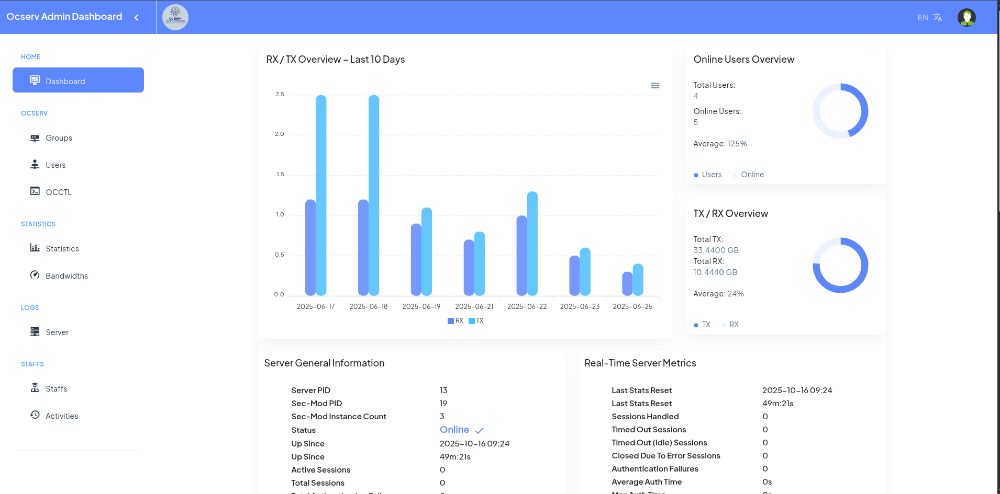
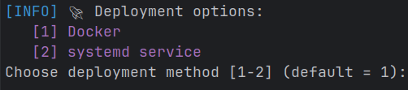

# OpenConnect VPN Server (Ocserv) with Web Admin Dashboard

A simple, efficient, and scalable solution to deploy and manage an **OpenConnect VPN server (ocserv)** with a powerful **web-based admin dashboard**.  
Easily manage users, groups, and server configurations while keeping your VPN secure and performant.

<p align="center">
  
</p>

<p align="center">
  
  
</p>

---

## 🌟 Key Features

### 1. User Management
- Create, update, remove, block, and disconnect users.
- Set traffic usage limits (e.g., GB or monthly usage).

### 2. Group Management
- Create, update, and delete user groups.
- Organize users into logical groups for easier management.

### 3. Command-Line Tools
- Use the `occtl` CLI utility to perform various server operations efficiently.

### 4. Statistics & Monitoring
- View real-time statistics for user traffic (RX/TX).
- Track data usage per user and per group.

### 5. Live Server Logs
- Monitor Ocserv logs in real-time directly from the web dashboard.

### 6. Staff Management
- Manage admin accounts: create, update, delete, and reset passwords.
- Track staff activities and administrative actions for accountability.

### 7. Customer Account Details & Usage
- View detailed customer account information.
- Monitor user-specific usage summaries and traffic data.

### 8. Internationalization (i18n)
- Multi-language support:
  - English (**en**)
  - Russian (**ru**)
  - Chinese (**zh**)
  - Arabic (**ar**)
  - Persian (**fa**)

---

## ⚙️ System Requirements

- **Docker-based:**
  - [Docker v28.5 or higher](https://docs.docker.com/engine/install/)
  - [Docker Compose v2.40 or higher](https://docs.docker.com/compose/install/)

- **Systemd-based:**
  - **Supported Operating Systems:**
    - [Debian 12 / 13](https://www.debian.org/download)
    - [Ubuntu 20.04 or higher](https://ubuntu.com/download/server)

  - **Programming Language:**
    - [Golang v1.25 or higher](https://go.dev/dl/)

---

## 🚀 Quick Start

1. Clone the repository:
```bash
git clone https://github.com/mmtaee/ocserv-users-management.git

cd ocserv-users-management

chmod +x install.sh

./install.sh
```
then select an option to continue:
<p>
  
</p>

---

## 🌐 Access the Admin Dashboard

1. **Open your web browser**.
2. **Navigate to** `https://YOUR-DOMAIN-OR-IP:3443` in the browser.
3. **Complete the administrative setup wizard**.
4. **Start managing users, groups, and VPN settings from the dashboard**.

---

## 🔒 Security & Scalability

- Designed with **best practices for security** to ensure a safe and reliable VPN environment.
- The web panel is intuitive and easy to use for both administrators and end users.
- Scalable architecture allows efficient management of multiple users and groups.
- Real-time usage tracking and monitoring built-in.
- If you encounter any issues, please refer to the documentation or contact support.

---
## 📦 License

This project is licensed under the **MIT License** — see the [LICENSE](LICENSE) file for details.

---
## 📈 Star History

[](https://www.star-history.com/#mmtaee/ocserv-users-management&Date)
